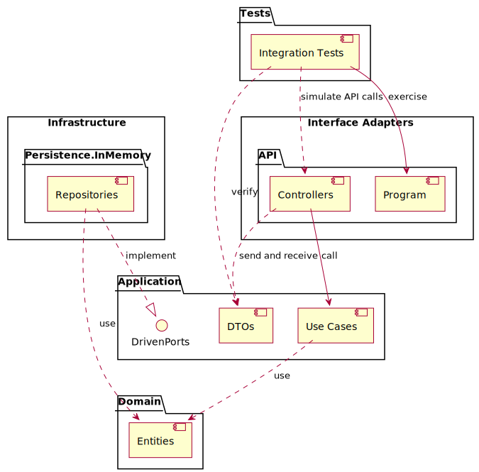
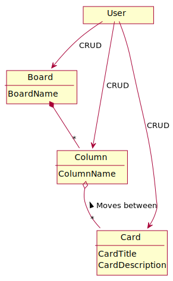
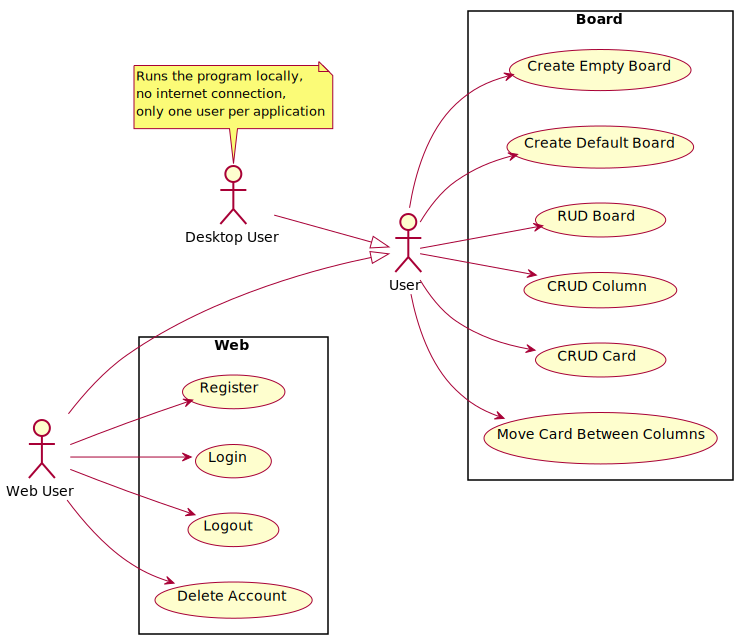

[](https://github.com/kahsez/KanbanBoard/actions/workflows/build-and-test.yml)
[](https://github.com/kahsez/KanbanBoard/actions/workflows/codeql.yml)

# Kanban Board

### Things to keep in mind

- Even though the domain is very poor, I am writing a lot of scaffolding because my goal is to show how I would
  approach a larger, modular, and scalable project.
- There is a [To-do list](docs/TODO.md) where I write the things I'm working on and the things I want to
  implement in the future
- The things I'm focusing on in this project are the different technologies used in backend development
  (Web API, persistence) so I'm following a TDD approach doing only integration tests.
- Instead of coding the domain logic first, I'm doing a vertical slice (from API to persistence) with a simple
  entity CRUD. I'll add the rest of the features later.

## Architecture



## The Application

A simple kanban board (something like Trello but simpler)

### Domain Model

Currently only Board exists



### Use Cases

Currently only CRUD Board use cases are implemented



## Naming conventions
- [Conventional commits](https://www.conventionalcommits.org/en/v1.0.0/#summary)
- Use cases
  - Name of the class is the name of the action
  - Avoid using names like ```Execute``` for methods

### Name equivalence:

| Used name    | Other names                                |
|--------------|--------------------------------------------|
| Use Cases    | Use Case Interactors, Application Services |
| Driven Ports | Secondary Ports,  Use Case Output Ports    |
| Request DTO  | Input Data                                 |
| Response DTO | Output Data                                |
| Test Helpers | Test API, Test Utils                       |
